+++
title = "WTML data collection files"
weight = 100
+++

A “collection” is a friendly name given to a WTML file. WTML is the
user-editable file format designed specifically for AAS WorldWide Telescope.
The **Explore** menu entry in the WWT interface is essentially a WTML browser.

Fairly simple examples of WTML files are those that contain only one type of
object entry, for example a list of tours, or a list of studies. Potentially
one of the most complex is a community payload file, which will often contain
a hierarchy of folders, each folder containing a collection of sub-folders and
objects. Objects can be tours, studies, panoramas, planets, all-sky surveys,
and links. Examples of the most common types of WTML file are listed in the
samples section.


# Structure of a Collection File

A collection file is coded in XML, and is a hierarchical collection of
**Folder** entries. The following example can be loaded into AAS WorldWide
Telescope and will appear as the image below, even though all the folders are
empty. The example is based on a community payload file, though a very similar
structure would apply to a hierarchical selection of tours or studies.

Note that the **Name** entries appear in the upper panel of AAS WorldWide
Telescope, and that one unique thumbnail image for each **Folder** is helpful
(though not required, a default thumbnail will be used if none is provided),
and more thumbnail images will be helpful for each entry within each
**Folder**. A substantial number of thumbnail images can be necessary if the
collection file is large.


## Example: Blank Collection WTML

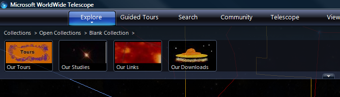

```xml
<?xml version="1.0"?>
<Folder Name="Blank Collection"
        Group="Explorer"
        Searchable="True"
        Type="Earth"
        Thumbnail="http://...../Images/T_Earth.jpg">
  <Folder Name="Our Tours"
          Group="Tour"
          Thumbnail="http://...../Images/T_Tours.jpg">
    <!-- Tour entries go in here -->
  </Folder>

  <Folder Name="Our Studies"
          Group="Explorer"
          Searchable="True"
          Type="Sky"
          Thumbnail="http://...../Images/T_Star.jpg">
    <!-- Studies go in here -->
  </Folder>

  <Folder Name="Context"
          Group="Search"
          Searchable="True"
          Browseable="False"
          Type="Sky">
    <!-- Context-only entries go in here -->
  </Folder>

  <Folder Name="Our Links"
          Group="Explorer"
          Searchable="True"
          Type="Sky"
          Thumbnail="http://...../Images/T_Red.jpg">
    <!-- Link entries go in here -->
  </Folder>

  <Folder Name="Our Downloads"
          Thumbnail="http://...../Images/T_Saucer.jpg">
    <!-- Downloads (PDF files, Word documents) go in here -->
  </Folder>

  <!-- Other toplevel place entries go in here -->
</Folder>
```

## Places

A place is simply a location for the view. **Place** entries are used within
[Studies](#studies) to contain imagery, but can be present in a collection
file as viewing points without any additional images. **Place** entries can
also be used to hold links to web pages (articles, supporting documents,
community website, and so on).

The following shows an example of a **Place** entry in **Sky** mode (a view of
the southern star Canopus).

| XML | Description |
| :-- | :-- |
| `<Place` | |
| `Name = "Canopus"` | The name of the star. |
| `Thumbnail = "http://...../Images/T_star.jpg"` | A URL to a thumbnail image for use in the top panel. |
| `DataSetType = "Sky"` | Set this to Sky in order to use RA and Dec. |
| `RA = "6.3991667"` | Right ascension of the star, in decimal hours. |
| `Dec = "-52.6952778"` | Declination of the star, in decimal degrees. |
| `ZoomLevel = "60.0"` | The Zoom Level when viewing the feature. Zoom Level is six times the Field of View, so a Zoom Level of 60 will give a Field of View of 10. |
| `Constellation = "CAR"` | Determines the constellation to be shown in the Properties panel. Set to the three or four letter code specified in the [Constellations](appendices.md#constellations) table, CAR for Carina in this case. |
| `Classification="Star"` | One of a range of [Classifications](appendices.md#classifications).|
| `Magnitude="-0.72"` | The _Apparent Magnitude_ of the star. This field does not affect the view, but is simply information that is displayed in the Properties for the place. |
| `Distance="19604298.227"` | The distance to the star in astronomical units (AU). Multiply light years by 63239.6717 to get the distance in AU. This field does not affect the view, but is simply information that is displayed in the Properties for the place. |
| `</Place>` |  |

The following shows an example of a **Place** entry in **Planet** mode (the
location of Olympus Mons on Mars).

| XML | Description |
| :-- | :-- |
| `<Place` |  |
| `Name = "Olympus Mons"` | The name of the feature. |
| `Thumbnail = "http://...../Images/T_mountain.jpg"` | A URL to a thumbnail image for use in the top panel. |
| `DataSetType = "Planet"` | Set this to Planet in order to use latitude and longitude. |
| `Lat = "18.0"` | The latitude of the feature, in the range -90 to 90 degrees. |
| `Lng = "133.0"` | The longitude of the feature, in the range -360 to 360 degrees. |
| `ZoomLevel = "60.0"` | The Zoom Level when viewing the feature. Zoom Level is six times the Field of View, so a Zoom Level of 60 will give a Field of View of 10. |
| `Angle = "45">` | The angle for the view. Zero, the default, will give a view vertically down to the planet surface. An angle of 45 degrees will angle the view up by 45 degrees. |
| `</Place>` |  |


The following shows an example of a **Place** entry containing a link (to a
high definition image of a gully on Mars):

| XML | Description |
| :-- | :-- |
| `<Place` |  |
| `Url="http://hirise.lpl.arizona.edu/PSP_005957_1435"` | Link to the web page.  This could be to an html web page, or to a document such as `.pdf` file. |
| `Thumbnail="http://...../Images/T_mars.jpg"` | Link to the thumbnail image. |
| `DataSetType = "Planet"` | This entry is optional, but should be present if the default of **Sky** is not correct for the data. If the user double-clicks the place thumbnail, then the mode will change to that set in this field before the web page is displayed. This mode change does not happen if the user single-clicks the thumbnail. |
| `Name = "Gully on Mars">` | Descriptive name of the web page. |
| `</Place>` |  |

## Thumbnail Images

Thumbnail images are used frequently throughout AAS WorldWide Telescope to provide
an image to go along with a link, either in the top pane under Collections or
Tours, or in the lower pane as part of a context search. Typically if you
prepare your own data you may well create a thumbnail image for it — usually
be taking a screen shot then capturing a rectangle of interest to match the
fixed sizes of the thumbnails given in this document. Note that URL entries
for thumbnails should always reference the full path, and not a relative path.

An alternative is to request a thumbnail image from the thumbnail server. This
is done by entering appropriate text at the end of the following query (the
example requests a thumbnail where the title contains the word "Mars"):

```html
http://www.worldwidetelescope.org/wwtweb/thumbnail.aspx?name=Mars
```

If a thumbnail image is not found containing the supplied text, as suitable
default is used.

## Studies

Study images are stored in image pyramids. Given an W×H pixel study, it is
represented as an N×N pixel image where N is the smallest power of 2 that is
at least as big as W and H. In mathematical terms, `N =
2^ceiling(log_2(max(W,H)))`. In simpler terms, if a study image is 958 by 768
pixels, it will be embedded in a 1024×1024 square bitmap. The extra area not
covered by the W×H photograph is occupied by transparent pixels. This forms
the lowest level of the pyramid, with each level up containing a
lower-resolution version of the original image with half the height and half
the width of the image at the previous level. At each level, the image is
further divided up into 256×256 tiles.

The process of dividing up an image into this pyramid of tiles can be done
using the Study Chopper tool. This tool not only creates the correct tiles,
but places them in the required directory structure, and outputs sample WTML
files to load them into WWT.

### Example: NGC 4579

For example, suppose we had a 1457×1201 study image, such as this Spitzer
image of Galaxy NGC 4579.

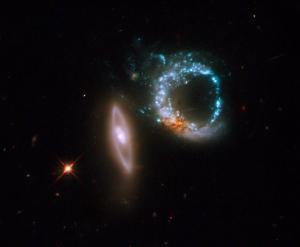

This image should be embedded in a 2048×2048 image and stored in a pyramid
with four levels: 0, 1, 2, and 3.

#### Level 3

At level 3 there would be 64 256×256 tiles containing the entire image (no
image is shown here for this level). The location is about Right Ascension
47.83 degrees (3h 11m 19s) and Declination 1.32 degrees (1d 18m 53s) in J2000
coordinates, and it is about 20 arc seconds wide.

#### Level 2

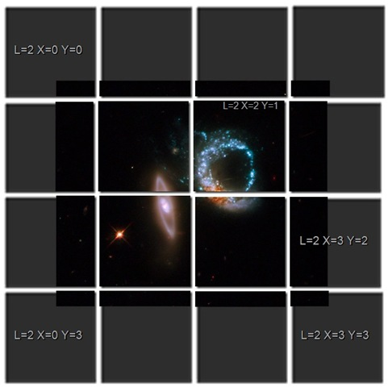

At level 2 there are sixteen 256x256 tiles representing a down-sampled
1024×1024 version of the image. The grey shadows show the transparent regions.
Some of the tiles have been labeled with X and Y coordinates between 0 and 3
— which is how individual tiles of the pyramid are addressed at each level.

#### Level 1

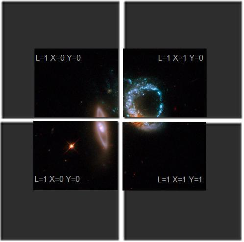

At level 1 there are four 256x256 tiles representing a further down-sampled
512×512 version of the image.

#### Level 0

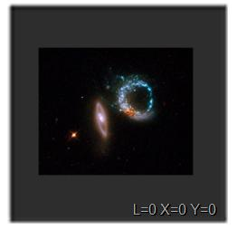

At level 0 there is a single down-sampled 256x256 version of the image.

The following table describes how the Galaxy NGC 4579 image might be entered
into a date file. The **Place** entry should be considered the position of the
view, and the **ImageSet** entry the position of the image itself.


| XML | Description |
| :-- | :-- |
| `<?xml version="1.0"?>` | |
| `<Folder` |  The **Folder** tags determine the structure of the hierarchy. |
| `Name="Galaxies"` | Enter a suitable project name. |
| `Group="Explorer"` | Usually set to **Explorer**. |
| `Searchable="True"` | Set to **True** if the study should be located by the WorldWide Telescope search feature. This feature is not currently implemented. |
| `Type="Sky">` | One of:**Sky**, **Planet**, **Earth**, **Panorama**, **Survey** |
| `<Place` |
| `Name="Spitzer image of Galaxy NGC 4579"` | The name that will be used as a title for the thumbnail in the top panel of WorldWide Telescope, and the string that will be recognized by a JScript web control. |
| `DataSetType="Sky"` |  One of: **Sky**, **Planet**, **Earth**, **Panorama**, **Survey** |
| `RA="3.1885833 "` | Right ascension, in decimal hours, of the center of the viewpoint for the study. To be the center of the image divide the RA of the image (**CenterX**) in the **ImageSet** tag (which is in degrees) by 15.0\. |
| `Dec="1.31471944444444 "` | Declination, in degrees, of the viewpoint for the study. This value often equals **CenterY** from the **ImageSet**. |
| `Constellation="CET"` | Determines the constellation to be shown in the Study Properties panel. Set to the three or four letter code specified in the [Constellations](appendices.md#constellations) table. |
| `Classification="Galaxy"` | One of a range of [Classifications](appendices.md#classifications). |
| `Magnitude="0"` | This field does not affect the view, but is simply information about the original picture that can be displayed in the Properties for the image. |
| `Distance="0"` | This field does not affect the view, but is simply information about the original picture that can be displayed in the Properties for the image. |
| `ZoomLevel="0.2"` | Distance away from the image of the view. Note **ZoomLevel** and **Field of View** refer to the same thing. The higher the zoom level the greater distance the viewpoint is away from the image. Maximum field of view is 60 degrees, the minimum is just below 0.00023. |
| `Rotation="0"` | Rotation of the view camera in degrees. Refer to the images to see how rotating the view camera, and rotating the image, compare. |
| `Opacity="100"` | Set to 100 for full opacity (no transparency). An entry of 50, for example, would mean 50% transparency. |
| `Angle="0"` | Up and down angle of the view camera if relative to the surface of a planet. Has no effect on a sky view Negative angles are acceptable. |
| `AngularSize="0">` |
| `<Target>Undefined</Target>` | The default is **Undefined**, but can be one of: **Sun**, **Mercury**, **Venus**, **Mars**, **Jupiter**, **Saturn**, **Uranus**, **Neptune**, **Pluto**, **Moon**, **Io**, **Europa**, **Ganymede**, **Callisto**, **IoShadow**, **EuropaShadow**, **GanymedeShadow**, **CallistoShadow**, **SunEclipsed**, **Earth**, **Custom**, **Undefined** |
| `<ForegroundImageSet>` | Contains one or more **ImageSet** entries, describing the foreground image. |
| `             <ImageSet` | Description of a single image. |
| `Generic="False"` | For foreground images this should be set to **False**. |
| `DataSetType="Sky"` | One of:**Sky**, **Planet**, **Earth**, **Panorama**, **Survey**. Note that images are currently only rendered in **Sky** mode. |
| `BandPass="Visible"` | The primary wavelength. One of: **Gamma**, **XRay**, **Ultraviolet**, **Visible**, **HydrogenAlpha**, **IR**, **Microwave**, **Radio**. Note that only one entry can be made, even if the image is a composite of several wavelengths. |
| `Url="_path._png"` | A URL that contains a link to the 256×256 tile pyramid  of the image. In this case, it is a path to an image on the web, but it can be any URL (for example, a local path or a SQL query) that contains the size of the pyramid coded in the {} parameters. This would be a path similar to `http://research.microsoft.com/...../530919080/{2}/{3}/{3}_{0}.png` |
| `TileLevels="3"` | The maximum level of the image pyramid used to store the study. The example study uses 4 levels numbered 0 to 3, so **TileLevels** is 3\. |
| `WidthFactor="2"` | Legacy entry. Set to **2**. |
| `Sparse="True"` | This is a hint to the rendering system, **True** indicates that the image is a study and will only appear on a section of the sky. |
| `Rotation="-5.0799999999867"` | Angle in degrees at which image is inclined. A positive number will rotate the image to the left, negative to the right (refer to the example images below). |
| `QuadTreeMap=""` | If the tiling of the image is processed using the LX, LY co-ordinate system, this entry should be ignored or left as an empty string. If the tiling is processed using a quad tree then this entry should contain a coding of how the quad tree is organized (for example, **QuadTreeMap="0123"**). Note that the [Study Chopper](worldwidetelescopedatatoolsguide.html) tool uses the LX,LY system. |
| `Projection="Tangent"` | For studies this should always be set to **Tangent**, as studies are tangentially projected. One of: **Mercator**, **Equirectangular**, **Tangent**, **Tan**, **Toast**, **Spherical**, **SkyImage**, **Plotted**. |
| `Name="Galaxy;Galaxy NGC 4579;NGC 5479"` | Semicolon separated list of words or phrases that can be located in a search. |
| `FileType=".png"` | One of ".jpg" or ".png". The period is optional. |
| `CenterX="1.3146065774006597"` | Right ascension of the center of the image, in decimal degrees. |
| `CenterY="47.828862896748753"` | Declination of the center of the image, in decimal degrees. |
| `BottomsUp="False"` | Set to "True" if the image should be inverted. |
| `OffsetX="-0.00277778"` | **OffsetX** and **OffsetY** will normally both be zero, indicating that the **CenterX** and **CenterY** position applies to the very center of the image. The image can be offset from the center by entering a non-zero value for either of these entries, which are then added to **CenterX** or **CenterY** to place the image in the view. Refer to the example image below. |
| `OffsetY="-0.00277778"` |  |
| `BaseTileLevel="0"` | Usually 0, for the index of the first level of tiling. Refer to the file structure output from the Image Chopper tool (explained in the [WorldWide Telescope Data Tools Guide](WorldWideTelescopeDataToolsGuide.html)). |
| `BaseDegreesPerTile= "0.02842076047738">` | This is the number of degrees of declination that the top tile of the pyramid occupies on the sky. Each Study is embedded in a larger 2^n×2^n image. This is also the number of degrees of declination that that larger image occupies on the sky. Use the formula: <br>_(Height of image in arc minutes \* largest image size)/(60 \* image height) = degrees_. <br> For example, an image 1200 pixels high set in a 2048 square tile that occupies one arc minute of the sky: (1 \* 2048)/(60 \* 1200) = 0.0284 degrees. |
| `<Credits>"NASA, ESA, and M. Livio (STScI) /Line2/Line3 Data were taken 2009." </Credits>` | Brief description of where the image came from, who made it, the date it was taken, and so on. Add "/" characters to show that the credits should appear on different lines. |
| `<CreditsUrl>"path.html"</CreditsUrl>` | URL to a site that might give more information on the image. |
| `<ThumbnailUrl>"path.jpg" </ThumbnailUrl>` | A link to an image (96×45 pixels) for use as a thumbnail. |
| `             </ImageSet>` |  |
| `</ForegroundImageSet>` |  |
| `</Place>` |  |
| `   </Folder>` |  |

The following images give examples of how the appearance of an image can be
changed by varying some of the parameters.


## Image Manipulations

The following text shows the starting point, with the resulting image shown
below.

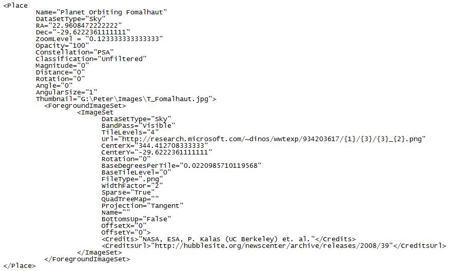

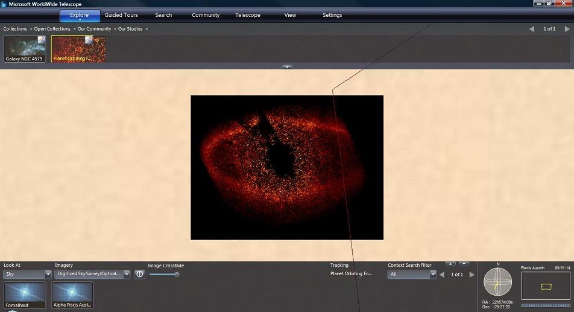

Changing the **Rotation** entry of the **ImageSet** to 45 will result in a 45
degree left rotation. If the **Rotation** was set at -45, the rotation would
be to the right.

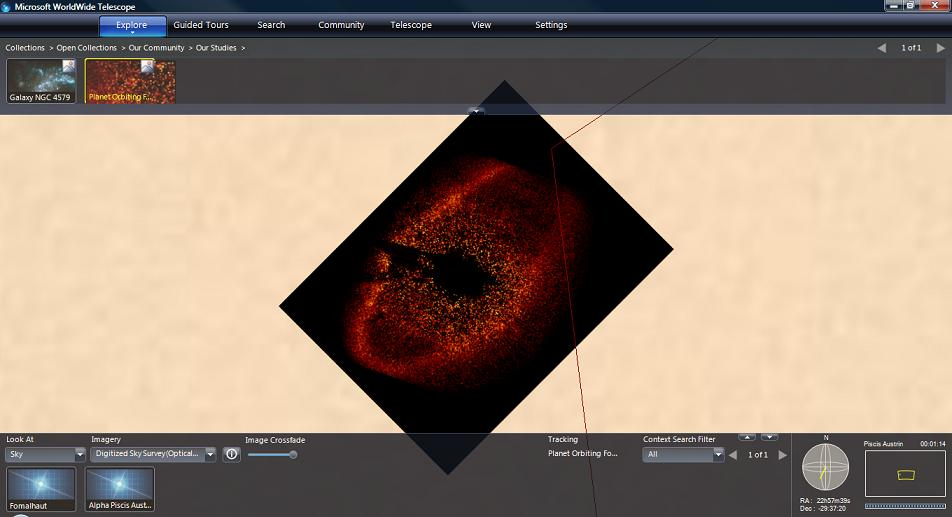

Leaving the **ImageSet** rotation at zero and changing the **Place** rotation
to -45 degrees results in the following image. Note the apparent variation in
the angle of the image, as the view is not perfectly aligned with the center
of the image.

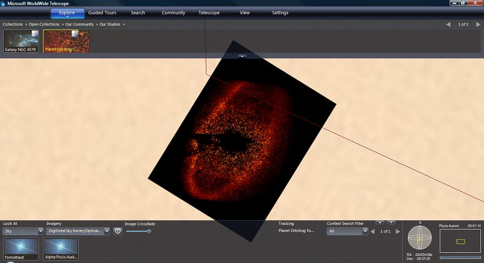

Leaving both rotation values at zero, and doubling the **ZoomLevel** to
0.246666:

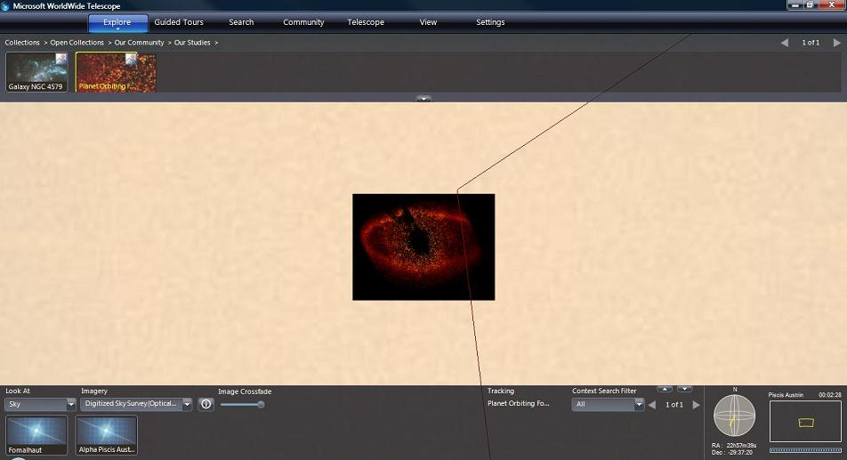

Changing the **ZoomLevel** to 10 results in a much more distant image:

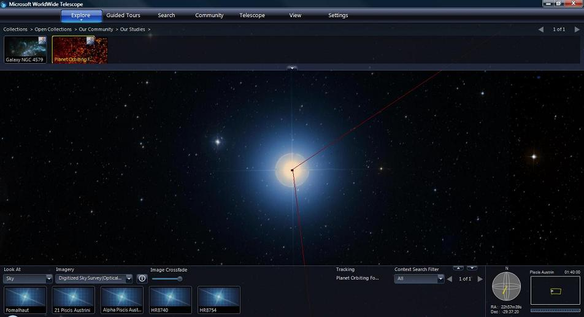

Changing the **Opacity** setting for the view to 25 (percent):

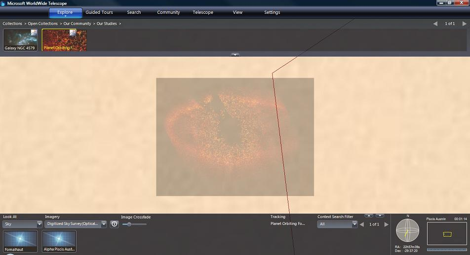

Applying an offset to the image (**OffsetX** = 0.001, **OffsetY** == 0.002),
results in a slight displacement of the image up and to the right.

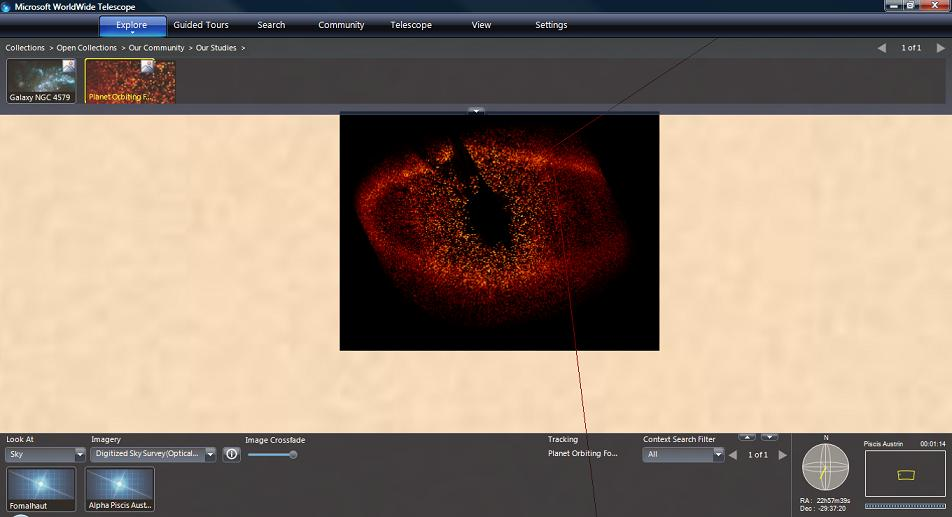


## Surveys

Surveys typically contain image data for the entire sky. The most popular
surveys are inevitably at the visual wavelengths, however there are many other
options at non-visible wavelengths — such as radio, x-ray, gamma, and so on.
Comparing the visual appearance of an object with a graphical representation
of one of the non-visible wavelengths is an important feature of WorldWide
Telescope.

This section describes the WTML file format used to contain survey data.

### Survey Data

Preparing a full sky survey involves a huge amount of data collection and
preparation, and a comparatively simple WTML collection file to render it. The
TOAST projection system for survey data is described in the
[AAS WorldWide Telescope Projection Reference](https://worldwidetelescope.gitbook.io/projection-reference/),
and the Sphere Toaster tool used to prepare data is described in the
[AAS WorldWide Telescope Data Tools Guide](https://worldwidetelescope.gitbook.io/data-tools-guide/).

Similar to studies, the source image data is converted into an image pyramid
for ease of rendering.

The WTML collection file used to render a survey is simpler than that for a
study, as no positional data is needed. The orientation of the survey is
determined using the Sphere Toaster tool.

There are few differences between the contents of a WTML file containing a
study or a survey. In particular note that the **Projection** entry is set to
**Toast** rather than **Tangent.**

```xml
<?xml version='1.0' encoding='UTF-8'?>
<Folder Name="TestSurvey">
   <ImageSet
     Generic="False"
     DataSetType="Sky"
     BandPass="Visible"
     Name="A Test Survey"
     Url="path to ..... \TestSurvey\{1}\{3}\{3}_{2}.png"
     BaseTileLevel="0"
     TileLevels="2"
     BaseDegreesPerTile="180"
     FileType=".png"
     BottomsUp="False"
     Projection="Toast">
     <Credits>Microsoft</Credits>
     <CreditsUrl>www.microsoft.com</CreditsUrl>
     <ThumbnailUrl>path to ..... \testsurvey.jpg</ThumbnailUrl>
     <Description />
   </ImageSet>
</Folder>
```

# Tours

The actual content of a tour is stored in a `.WTT` file. These files include a
lot of binary information and are not designed to be human-readable. However,
WTML files can contain references to tours. These references can be used in
conjunction with a set of images, so that an appropriate tour or range of
tours is available for the new image data (the references to the new images
are embedded in the WTT file). Alternatively of course tour collections can be
put together for existing image data.

All but two of the parameters in a **Tour** entry are optional, and are
identified in the table.


| XML | Description |
| :-- | :-- |
| `<?xml version='1.0' encoding='UTF-8'?>` | |
| ` <Folder` | Top level Folder |
| `   Name ="Samples">` | <This name will appear as part of the location string in the UI of WorldWide Telescope. For example: **Open Collections > Samples** |
| `   <Folder` | Tour Folder |
| `    Name="Our Tours"` | This name will appear as part of the location string in the UI of WorldWide Telescope. For example: **Open Collections > Samples > Our Tours** |
| `    Group="Tour">` | Enter **Tour**. |
| `    <Tour` | |
| `     Title="Apollo Missions"` | Name of this tour. Not required but very helpful. |
| `     ID="8939B405-9261-49d4-A7C4-52847A51A08A"` | **Required**. Enter a Guid to uniquely identify the tour. The Visual Studio Tools/Create Guid utility is a good way of generating Guids. |
| `     Description="Brief history of Apollo missions"` | Brief description of the tour. If the description is longer than one line in the properties dialog, it will be wrapped and justified appropriately. |
| `     Author="A.N. Author"` | Author's name. |
| `     OrganizationName="Microsoft Research"` | Name of the organization, can be left empty. |
| `     AverageRating="4"` | Rating, out of five, for the tour. |
| `     AuthorImageUrl ="http://research.microsoft.com/....jpg"` | A link to a thumbnail image, 72 pixels wide by 96 in height, of the author. |
| `     ThumbnailUrl =”http://research.microsoft.com/....jpg”` | A link to a thumbnail image, 96 pixels wide by 45 in height, for the tour. The bold "T" (for _tour_) in the top right hand corner is added by WorldWide Telescope, so should not be included in the thumbnail. |
| `     TourUrl ="http://research.microsoft.com/....WTT"` | **Required**. Link to the .WTT file containing the tour. |
| `     LengthInSecs=”243”` | The approximate length of the tour in seconds. This entry is only used in the tour properties dialog, as information for users. |
| `     RelatedTours="26BB4C2E-52F1-4fdf-8C99-31556E791FC6;26BB4C2E-52F1-4fdf-8C99-31556E791FC7"` | List of related tours identified by their ID entry. This feature is currently only implemented for the default tours. |
| `   </Folder>` | |
| `</Folder>` | |

The following example shows the minimal meaningful information necessary to
add a **Tour** entry.

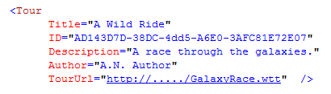

### Default Tours

The default tours used by the Windows version of AAS WorldWide Telescope are held
in the `tours.wtml` file, in the following locations:

- Windows Vista: `C:\Users\<userid>\AppData\Local\Microsoft\WorldWideTelescope\data\`
- Windows XP: `C:\Documents and Settings\<userid>\Local Settings\Application Data\Microsoft\WorldWideTelescope\`

Currently there is not a supported process to add your own tours to this file.


# Communities

Communities are the primary way in which AAS WorldWide Telescope users can share
data and tours with each other. Communities can be made by any user, but
typically are individuals or organizations, such as planetariums, science
centers, astronomy clubs, magazines, bloggers, schools, classes, and for class
projects. There is no limit to the number of communities that can be set up.

## Setting up a Community

You can set up your own community using your own servers and without any
contact with Microsoft. However, you may prefer to have your community listed
it on the WorldWide Telescope Community Directory (a subset of which is shown
on the
[WWT Support page](http://www.worldwidetelescope.org/help/SupportHelp.aspx)).
To do this, send an email to `wwt@aas.org`, requesting that your community be
listed. To be considered for inclusion in the community directory, community
sites must maintain standards in terms of quality, scalability, and content
appropriateness. These standards include:

* Sign-up membership can be required by your community, but community access
  must remain free for all users.
* Community content must be well moderated, free of hate speech, and reflect
  currently accepted astronomical information/theory. The installation must
  have sufficient capacity for handling projected traffic.
* The community must make use of integrated AAS WorldWide Telescope features
  such as tours, sky-aligned images, and so on. Not just simple HTML links
  to existing web content.

To set up a community go through the following steps:

* [Step 1: Set the Mime Types](#step-1-set-the-mime-types)
* [Step 2: Create a Thumbnail Image](#step-2-create-a-thumbnail-image)
* [Step 3: Create a Payload File](#step-3-create-a-payload-file)
* [Step 4: Create a Signup File](#step-4-create-a-signup-file)
* [Step 5: Accessing the Community](#step-5-accessing-the-community)

### Step 1: Set the Mime Types

To set up a community, you should first add the AAS WorldWide Telescope file
extensions to the MIME types on your server.

| File type | File extension | MIME Type |
| :-- | :-- | :-- |
| WWT Collections (and Communities) | .WTML | `application/x-wtml` |
| WWT Tours | .WTT | `application/x-wtt` |
| WWT Constellation Figures | .WWTFIG | `application/x-wwtfig` |

### Step 2: Create a Thumbnail Image

Create a thumbnail image for the community. This should be 176 wide by 45
pixels in height.

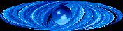

### Step 3: Create a Payload File

The payload file contains the main content for a community. This file
determines the folder structure, images, tours, community metadata, and so on.
In its simplest form, a payload file can be a static WTML file that is
hand-edited on the server side. Alternatively it can be generated from a
database, and so might be much easier to update regularly.

Typically payload files contain the following:

* Tours
* Study Images
* Surveys
* Panoramas
* Places: lists of locations (**Place** entries without an **ImageSet**)
* Catalogs
* Constellation figures (files with the WWTFIG extension)
* Links to articles or the organization’s website
* Links to Blog entries, forums, conversation threads, discussion boards

A sample community payload file is
[sample-community-payload.wtml](sample-community-payload.wtml).

### Step 4: Create a Signup File

A signup file is a short WTML file that points to the thumbnail and payload
files, and gives the title of the community. The following table shows a
sample signup file, based on the signup file for the WWT Data Community.

| XML | Description |
| :-- | :-- |
| `<?xml version="1.0" encoding="UTF-8"?>` | |
| `<Folder` | One Folder entry. |
| `    Name= "WWT Data Community"` | Name of the community. |
| `    Group="Community"` | Set to **Community**. |
| `    Thumbnail= "http://example.com/communitylogo.jpg"` | Full URL of the community thumbnail. |
| `    Url= "http://example.com/communitypayload.wtml"/>` | Full URL of the payload file. |

A sample community signup file is also listed at
[sample-community-signup.tml](sample-community-signup.wtml)

### Step 5: Accessing the Community

The signup file should be placed in a web-accessible location, and
appropriately linked to from your institution/organization/club website.

## Including Other WTML Files

A WTML file can include references to other WTML files, which can then be used
to build up collections of collections, or add studies and surveys to a
community payload file, for example. To include another WTML file in a
collection, add the following entry:

| XML | Description |
| :-- | :-- |
| `<?xml version="1.0" encoding="UTF-8"?>` | |
| `<Folder` | |
| `  Name="Name of collection" ` | A friendly name for the file to be included. |
| ` Group="Explorer" ` | For most included files this should be set to **Explorer**. |
| ` Url="http:/..../filename.wtml" ` | Path to the file to be included. This can be a local path or http address. |
| ` Thumbnail="http:/...../thumbnail.jpg" /> ` | Thumbnail image to use in the top pane. Note the closing bracket for the folder entry. |


## WTML Samples

The following table lists the samples that can be used as a starting point for
WorldWide Telescope WTML file development.

Click on the **Sample Name** to view the source. Note that paths may need to
be changed for the samples to work, these paths are highlighted by comments in
the sample code.

| Sample Name | Description |
| :-- | :-- |
| [WTML Blank Collection](sample-blank-collection.wtml) | Shows the hierarchy of a collection, without any content. |
| [WTML Sample Study](sample-study.wtml) | Shows a collection of two studies. One image at the center of Pisces and one at the center of Aquarius. |
| [WTML Sample Tour Collection](sample-tour-collection.wtml) | Shows a collection of two tours. |
| [WTML Sample Panorama Survey](sample-panorama-survey.wtml) | Shows a collection containing a single panorama. |
| [Sample Community Signup](sample-community-signup.wtml) | Shows a community signup file. |
| [Sample Community Payload](sample-community-payload.wtml) | Shows a community payload file that can be used as a starting point for a new community. The community includes tours, studies, downloads and links. |
