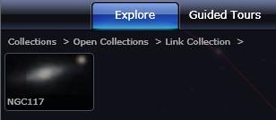
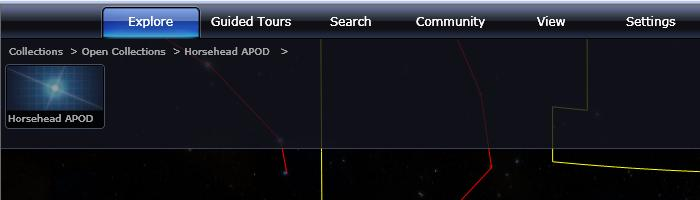
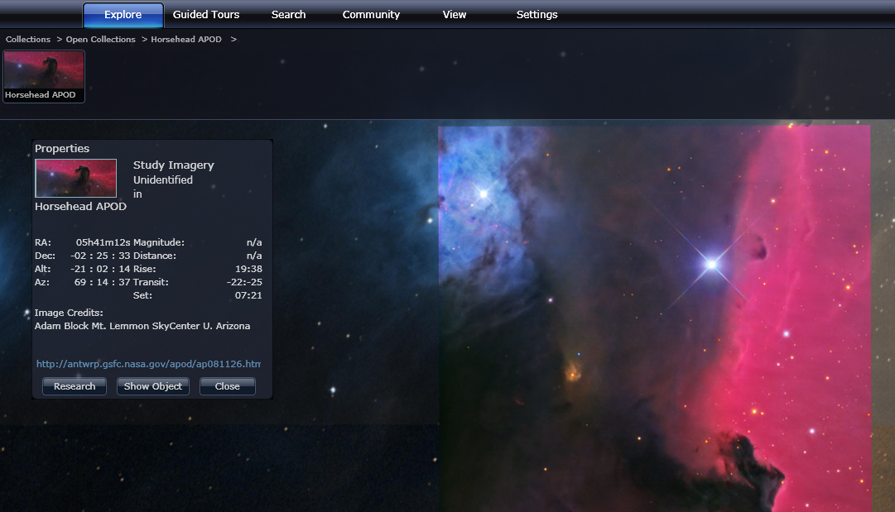
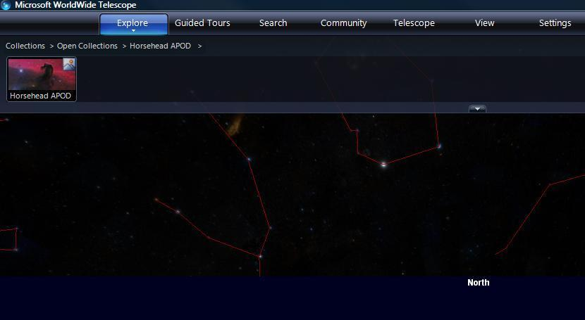

+++
title = "URLs for Sharing Views"
weight = 200
+++


The information in this section doesn’t really fit in well with the rest of
this document. The documentation for the <a
href="https://wwt-api-client.readthedocs.io/">wwt-api-client Python module</a>
covers the same material and will be maintained going forward.


There are two single URL based controls, **Goto** and **ShowImage** that
enable the sharing of views by simply providing recipients with the URL.
**Goto** is the simpler of the two, and enables a link to a particular point
in space (RA, Dec and Zoom) to be captured, and then sent, for example, by
email. **ShowImage** is similar, but includes more information (including a
link to an image) that enables the sharing of that single image, without the
need to write a WTML data file or create a community. If a valid data file
does exist, a command line parameter can be used to initiate the Windows
Client version.


# Goto

To capture a link from the AAS WorldWide Telescope, right click to bring up the
**Finder Scope**, select **Research** then **Copy Shortcut** from the menu.
This will encode the current view into a URL.

The base of the URL is as follows:

```
http://www.worldwidetelescope.org/wwtweb/goto.aspx?
```

Following this there are four required parameters, separated by the ampersand
(&) symbol:

| Required Parameter | Description |
| :-- | :-- |
| `object=string` | Name to appear on the thumbnail, under **Collections > Open Collections > Link Collection**. |
| `ra=double` | Right ascension (RA) of the view center. |
| `dec=double` | Declination (Dec) of the view center. |
| `zoom=double` | Zoom factor (6 x Field of View). |


| Optional Parameter | Description |
| :-- | :-- |
| `wtml=true` | The default behavior is that this will open the image in the Windows Client version of WWT, rather than the Web Client version. This assumes that the mime-type for WTML files is set to the Windows Client. |

For example:

<http://www.worldwidetelescope.org/wwtweb/goto.aspx?object=NGC117&ra=0.453&dec=1.333888889&zoom=0.157005192359341>

If the receiver of the email clicks on this link, it should open up the Web
client version of WWT, and provide a thumbnail that can be
selected for the specified view to be rendered:



Note that the shortcut can be captured from either the Windows Client or Web
Client versions of WorldWide Telescope. Clicking on the link will open up the
Web Client version unless the `wtml=true` parameter is set.


# ShowImage

The **ShowImage** control enables an image to be shared, by embedding
information about the image in a URL. The URL could then, for example, be
emailed to colleagues who could then view the image in WorldWide Telescope
simply by clicking on the link. Unlike [**Goto**](#goto), there is no
automated way of creating the URL from within WorldWide Telescope.

Of course the image, and optionally a thumbnail of it, must be web accessible
for this to work. The image should also have a maximum size of 2048×2048
pixels. If larger sized images are required, then WTML data files should be
set up to tile the image correctly (refer to the
[AAS WorldWide Telescope Data Tools Guide](https://worldwidetelescope.gitbook.io/data-tools-guide/)).

The base of the URL is as follows:

```
http://www.worldwidetelescope.org/wwtweb/ShowImage.aspx?
```

Add to this base the following parameters, with an ampersand (&) between each
parameter.


| Required Parameter | Description |
| :-- | :-- |
| `name=string` | User friendly, but relatively unique name.
| `ra=double` | Right ascension (RA) of the image center (or tangent point) from the plate solution. |
| `x=double` | Pixel position corresponding to the RA. |
| `dec=double` | Declination (Dec) of the image center (or tangent point) from the plate solution. |
| `y=double` | Pixel position corresponding to the Dec. |
| `scale=double` | Arc seconds per pixel from the plate solution. |
| `rotation=double` | Rotation east of north. |
| `imageurl=string` | URL encoded link to the original image at the scale and size of the image described in the rest of the URL. |

| Optional Parameter | Description |
| :-- | :-- |
| `wtml=true` | The default behavior is that this will open the image in the Windows Client version of WorldWide Telescope, rather than the Web Client version. This assumes that the mime-type for WTML files is set to the Windows Client.
| `thumb=string` | Link to the thumbnail image. The thumbnail should be 96x45 pixels. |
| `credits=string` | Appropriate credit text. |
| `creditsUrl=string` | Link to the credit information or image page. |
| `reverseparity=Bool` | True inverts the image, False is the default. |
| `goto=Bool` | True indicates that WorldWide Telescope will slew and zoom on the image only. False (the default) indicates that the image thumbnail will appear under **Open Collections** and the user must select this to slew and zoom to the image. False also indicates that the user can save the image to their own collections. |
| `debug=Bool` | True indicates that the WTML file will be shown, rather than launched. False is the default. |

## Examples

The example URL shown below will only result in a default thumbnail and the
name being added to the **Open Collections**. For the user receiving the URL
to view the image, they will need to click on the thumbnail.

<http://www.worldwidetelescope.org/wwtweb/ShowImage.aspx?name=Horsehead+APOD%20&ra=85.2983&dec=-2.42589&x=450&y=300&scale=1.69&rotation=90.21&imageurl=http://antwrp.gsfc.nasa.gov/apod/image/0811/horsehead_caelum.jpg>



In this second example the optional parameters `thumb=`, `credits=`, and
`creditsUrl=` have been added to improve the experience for the user receiving
the URL. When the image appears, note the better looking thumbnail image, and
the credits text and link in the **Properties** panel.


<http://www.worldwidetelescope.org/wwtweb/ShowImage.aspx?name=Horsehead+APOD%20&ra=85.2983&dec=-2.42589&x=450&y=300&scale=1.69&rotation=90.21&imageurl=http://antwrp.gsfc.nasa.gov/apod/image/0811/horsehead_caelum.jpg&thumb=http://research.microsoft.com/~dinos/wwtimages/tn_horsehead_caelum.jpg&credits=Adam+Block+Mt.+Lemmon+SkyCenter+U.+Arizona&creditsUrl=http://antwrp.gsfc.nasa.gov/apod/ap081126.html>



In this third example, the collection file is opened as a raw WTML file, causing it
to be opened by the Windows client rather than the web client if it is installed.

<http://www.worldwidetelescope.org/wwtweb/ShowImage.aspx?name=Horsehead+APOD%20&ra=85.2983&dec=-2.42589&x=450&y=300&scale=1.69&rotation=90.21&imageurl=http://antwrp.gsfc.nasa.gov/apod/image/0811/horsehead_caelum.jpg&thumb=http://research.microsoft.com/~dinos/wwtimages/tn_horsehead_caelum.jpg&wtml=true>





# Loading Files with the Windows Command Line

To open WTML data files or WTT tour files with the Windows client, go through the following steps:

1.  Open up a Command Prompt window.
2.  Navigate to the folder containing the `WWTExplorer.exe` file. By default
    this is: `C:\Program Files (x86)\Microsoft Research\Microsoft WorldWide Telescope\`
3.  Type a command such as:
    ```
    wwtexplorer path\datafile.wtml
    ```
    or
    ```
    wwtexplorer path\tourfile.wtt
    ```
    ensuring that the full path and filenames are correct.
4.  This should open up WWT with either the collection thumbnail from a WTML
    file displayed under **Collections > Open Collections**, or will start up
    a tour if a valid tour file is used as the command line parameter.
