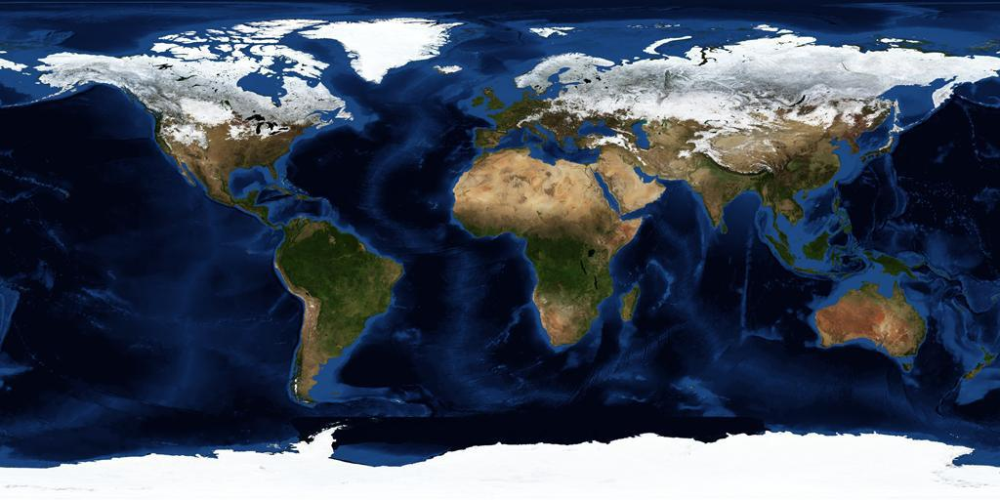

+++
title = "Source Projections"
weight = 100
+++

The following projections can be used as the source for a conversion to the
TOAST format:

* [Equirectangular Projection](#equirectangular-projection)
* [Mercator Projection](#mercator-projection)
* [Gnomonic Projection](#gnomonic-projection)

# Equirectangular Projection

With Equirectangular coordinates, every pixel represents the same number of
degrees of latitude and longitude for planets, and degrees for Right Ascension
(RA) and Declination (Dec) for sky surveys. Equirectangular projection is by
far the most common system used to represent earth maps, such as the NASA Blue
Marble map shown below. The utility of this projection is greatly assisted by
the simple fact that very few people live near the poles, where the projection
becomes problematic, in particular all the points along the top of an
equirectangular projection represent only one point in 3D space, namely the
North Pole. And of course there is a similar singularity for the lower edge of
the map and the South Pole.

This composite image of Earth was taken in January 2004. (Credit: NASA,
Visible Earth.)

The wider problem with equirectangular projections is that the relative sizes
of objects (land masses in the map above) are substantially incorrect. An
equirectangular image that covers the entire sphere will have a 2×1 aspect
ratio, so it is two times as wide as it is high (a full circumference
east-west, half a circumference north-south).

# Mercator Projection

Unlike equirectangular projection, Mercator projection preserves angles, so is
useful in marine navigation, but at the expense of distorting the relative
sizes of land masses. The distortion of sizes is even greater than in
equirectangular projection, with Greenland appearing about the same size as
Africa in Mercator projection, about half the size in equirectangular
projection, and about one fourteenth the size on a globe.

Mercator projection is a specific example of cylindrical projection — where
horizontal lines are preserved in the mapping.

# Gnomonic Projection

A flat map is achieved by projecting from the center of the sphere,
perpendicularly through the surface of the sphere, to a tangent plane. Unlike
the previous two projection systems gnomonic only enables less than half of
the sphere to be projected onto one map. Also known as tangential projection,
gnomonic projection displays all great circles as straight lines, so for
example, the meridians and equator appear as straight lines on the map.
