+++
title = "The TOAST Projection"
weight = 200
+++

TOAST (Tessellated Octahedral Adaptive Subdivision Transform) is an extension
of as system of representing a sphere as a hierarchical triangular mesh. The
extension takes the mesh and flattens it into a square for use as a texture.


# Approximating a Sphere

A Hierarchical Triangular Mesh (HTM) is a representation of a sphere proposed
by astronomers in the Sloan Digital Sky Survey. It first models the sphere as
an octahedron, then recursively subdivides each triangular face until the
sphere is closely approximated by a highly tessellated polyhedron. WorldWide
Telescope extends the concepts of HTM, where the subdivided octahedron is
folded out flat into a square.

The recursive subdivision of tiles using an HTM system is shown in the
following images. Basically, a sphere is modeled as a polygon (starting with
an octahedron) that has lots of triangular faces. If the octahedron was folded
flat, the North pole would be at the center, the south pole at each of the
four corners, and the equator would form a diamond within the square.

The following images shows the first three levels of HTM subdivision. As each
side is subdivided the new point would be on the surface of a perfect sphere.
Even after just three iterations the polyhedron is getting close to
approximating a sphere.

| Image | Flat |
| :-- | :-- |
| 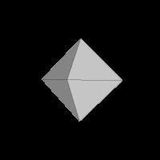 | 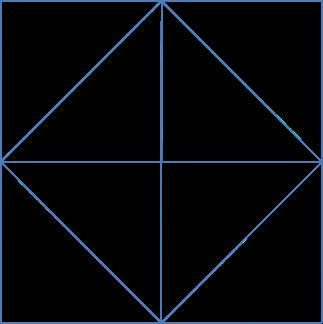 |
| 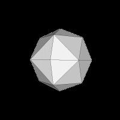 |  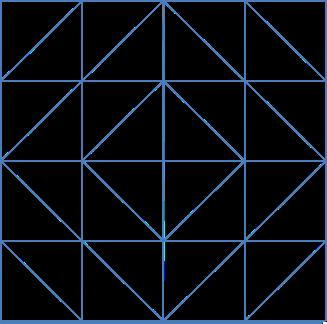 |
| 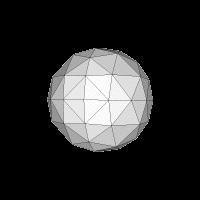 | 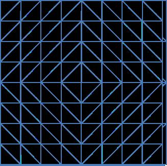 |

Image credits: Jonathan Fay, Tom McGlynn (NASA SkyView)


# TOAST Map of Earth

When the equirectangular earth map is converted to TOAST, it looks like the
following:

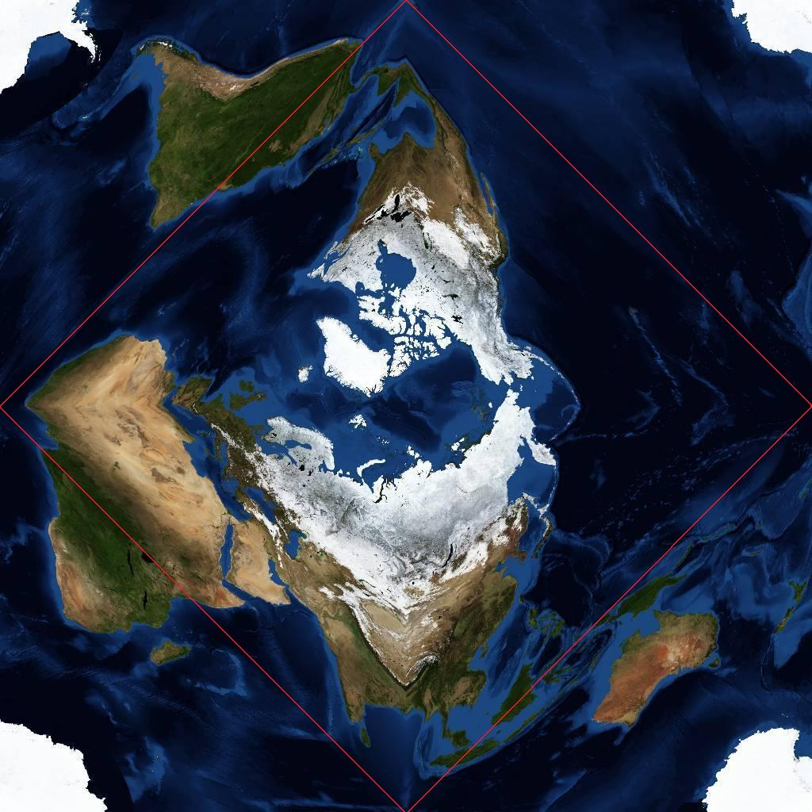

The unusual warping in this image can be interpreted. The North Pole is in the
center, and Antarctica split into four at the corners. In fact, all four
corners meet at exactly the same point – the South Pole. The Equator follows a
square whose corners are the middle of each side (shown by a red line in the
image). The wrap-around in TOAST is shown in the following image. Each point
on the side of the TOAST square, for example, A, B, C and D, will be adjacent
to the points `A`, `B`, `C` and `D` when the projection is mapped onto a
sphere.

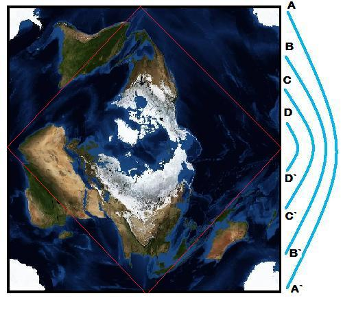

The following images show the process a little simpler. The 1000 x 500 pixel
equirectangular image on the left produces the TOAST projection on the right,
and if the collection file produced by the Sphere Toaster tool (with the
output set to **Planet**) is loaded into WorldWide Telescope, the planet in
the lower image will appear:


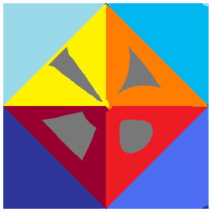

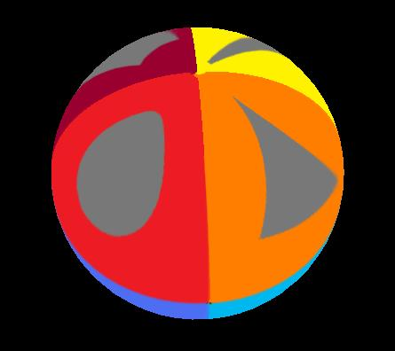


# Inside and Outside Projections

Right ascension and longitude values in TOAST depend on whether the projection
is being used to represent the inside or outside of a sphere. Notice that the
degrees of RA/longitude are on the opposite sides in the following two
diagrams.

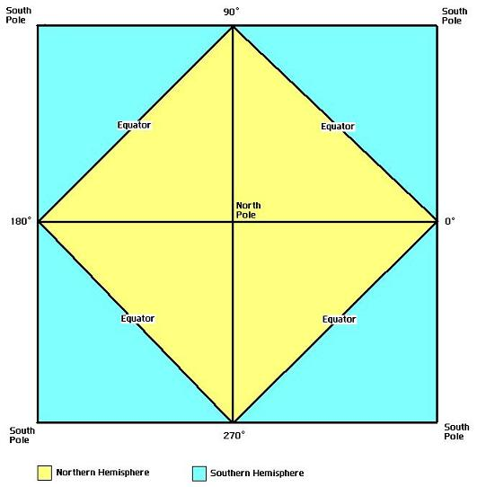
The inside of a sphere

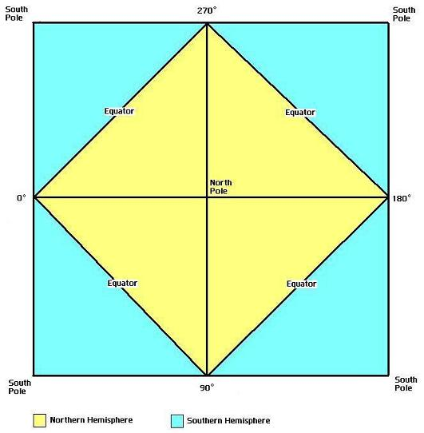
The outside of a sphere

The resolution of a TOAST image is not even across the square, for example the
following three lines all represent one circumference of the sphere, yet all
three lines are of different lengths ```(2L * sqrt(2), 2L, and L * sqrt(2)```
respectively, where L is the length of one side of the square). This
difference in resolution across a single image is still far less than that of
equirectangular projection.

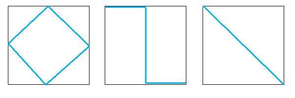


# Image Pyramids

The TOAST representation of a sphere can be a rather large square, so it is
stored as an image pyramid. In this image pyramid, each lower level contains a
higher-resolution version of the total image. One level down has twice the
width and twice the height (so four times a greater area) of the image in the
previous level. At each level, the image is tiled into 256×256 images. The
purpose of having image pyramids is that as the viewer gets closer and closer
to an object (a galaxy, for example) the rendering of that object becomes
progressively more detailed. Alternatively as the viewer moves away from an
object, less and less computing power is needed to render the image as lower
levels of the image pyramid are used. The first level is a single 256 by 256
tile, which is obviously used when the view is at its maximum (perhaps looking
at the stars from the Earth). At level 7, the default deepest level, there are
128×128 (16384) tiles.

| Level | Number of Tiles | Height, or Width, of the Total Image in pixels | Approximate TOAST Resolution (arcmin/pixel) |
| :-- | :-- | :-- | :-- |
| **0** | 1 | 256 | 42.19 |
| **1** | 4 | 512 | 21.09 |
| **2** | 16 | 1,024 | 10.55 |
| **3** | 64 | 2,048 | 5.27 |
| **4** | 256 | 4,096 | 2.64 |
| **5** | 1,024 | 8,192 | 1.32 |
| **6** | 4,096 | 16,384 | 0.66 |
| **7** | 16,384 | 32,768 | 0.33 |
| **8** | 65,536 | 65,536 | 0.165 |
| **9** | 262,144 | 131,072 | 0.0825 |
| **10** | 1,048,576 | 262,144 | 0.04125 |
| **11** | 4,194,304 | 524,288 | 0.020625 |
