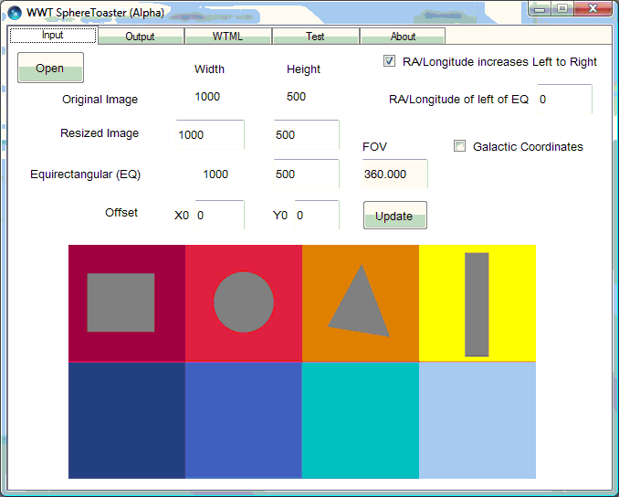

+++
title = "Sphere Toaster"
weight = 200
+++

WWT Sphere Toaster takes as input an equirectangular image, and produces as
output a tile pyramid of images suitable either for background images (such as
a complete sky survey), or for spherical object surfaces (such as stars,
planets and moons). Suitable WTML files encapsulating the tile pyramid, and a
thumbnail image, are also output. The tile pyramid is produced using the TOAST
projection system described
[elsewhere in this guide](@/spherical-projections/toast-projection/index.md).

The following examples use a test image for clarity.


# Preparing a Single Image

To convert a single equirectangular image of an entire object (sky survey,
planet or moon surface, for example), go through the following procedure. Note
that the entire image is loaded into memory by this tool, so there are limits
on the size of image that the tool can currently process. This limit is
increased if the tool is run on a 64-bit operating system.

1. When the tool is run the **Input** tab appears. Use the **Open** button to
   select the equirectangular image. The equator will appear as a red line
   across the center of the image.

   

   This image shows the default settings when a 1000×500 image is loaded.

2. Next, select the **WTML** tab.

   

   Enter appropriate text for **Title**, **Credits**, and **Credits URL**.
   **Credits** should be kept to a maximum of 240 characters.

   The **Storage URL** entry is the web accessible location where the final
   output should be stored.

   The **Make Wtml** button can be used if only WTML files are required.
   Otherwise they are generated from the **Output** tab.

3. Now select the **Output** tab.

   

   Ensure to select one of **Panorama**, **Sky** or **Planet**. These will
   affect the inside or outside orientations of the sphere.

   The maximum levels of a pyramid should not be increased, but can be
   decreased during testing - to improve performance.

   Refer to the note on [Plate Files](../study-chopper/index.md#plate-files).

   Selecting **Generate Pyramid + WTML** will create the image pyramid, WTML
   files, and thumbnail.

4. The **Test** tab can be selected after the input file is selected and with
   the **Panorama**, **Sky** or **Planet** orientation set in the **Output**
   tab. It is not necessary to generate any output to run the test.

   

   The default test is for level 0, and X and Y at 0.

   This image shows level has been set to 1 to examine one of the four tiles
   at this level.

That completes the process in the simplest of cases — one image covering the
complete sphere. Note that a very large number of tiles can be produced. For
example, if the original image is 8192×4096 pixels, then 1365 tiles are
generated in a full pyramid with five levels (and this can take 10 to 20
minutes of computing time). If the original image is 20000×10000 pixels, then
over 21500 tiles are created at the required 7 levels (and this can take 24
hours of computing time). Blank tiles are not created. By default, all tiles
are png images, though this can be changed to jpeg, though the jpeg format
does not store transparency and can have undesirable artifacts.


# Special Cases

The single example will cover the great majority of cases of the use of this
tool. However there are a few other options that might be of value.

* If the **RA/Longitude increases Left to Right** box is unchecked, then the
  RA/longitude is assumed to increase right to left, and the layout of the
  output is changed from the image on the left to the image on the right:

  
  
* If the **Galactic Coordinates** checkbox is selected, then the coordinate
  system is changed from J2000 to galactic coordinates.

  
* Change the value of **RA/Longitude of left of EQ** if the left hand side of
  the image is not at Longitude 0. For example, a map of the Earth will often
  have Longitude -180 for its left edge, so enter -180 in this field. A value
  of 45 was entered to give the image below.

  
* For Panoramas it can be helpful to use the **Offset** settings to center the
  image around the "equator".

  
  

* There are additional options on the **Output** tab if Panorama is selected,
  giving a range of choices on how to fill the empty void above the panorama
  image.

  The panorama source image
  

  The output options
  

  **No Fill**
  

  **Extend top row**
  

  **Average of top row**
  

  **Zone V Grey**
  


# Initializing Sphere Toaster

Sphere Toaster requires the following dll files to work: `WwtDataUtils.dll`,
`OctMap.dll`, `BigPic.dll`, `PlateTools.dll`. These should be in their correct
location on installation.

The configSphereToaster.txt file, in the same location as the program, can be edited to change the default output directory.

```
OUTDIR=C:\Users\Public\Public Documents\example\
```


# Command Line Input to Sphere Toaster

The Sphere Toaster tool can be run from a Command Prompt window, taking a
single parameter — the name of an XML file, where the content of that file
determines the required input and output.

To run the tool from the Command Prompt window:

1. Navigate to the location of SphereToaster.exe. By default this is:
   ```
   C:\Program Files (x86)\Microsoft\WWT ADK May 2009\
   ```
2. Create an XML file to define the inputs and outputs. The contents of the
   XML file should be as follows:
   ```xml
   <?xml version="1.0" encoding="utf-8"?>

     <!-- ************************************************************ -->
     <!--        Settings for the command line input for               -->
     <!--                the Sphere Toaster tool                       -->
     <!-- ************************************************************ -->
   <SettingsFile Type="Toaster">

     <!-- ************************************************************ -->
     <!--                        Required                              -->
     <!-- ************************************************************ -->

     <InputFile>C:\Users\....\Pictures\Rowers.png</InputFile>
     <Type>Planet</Type>
     <OutputFolder>C:\Users\....\Pictures\Toaster</OutputFolder>

     <!-- ************************************************************ -->
     <!--                        Optional                              -->
     <!-- ************************************************************ -->

     <RALefttoRight>True</RALefttoRight>
     <RALeftofEQ>0</RALeftofEQ>
     <Galactic>False</Galactic>
     <OffsetX0>0</OffsetX0>
     <OffsetY0>0</OffsetY0>

     <Overwrite>True</Overwrite>
     <MakePlate>False</MakePlate>
     <SaveAsJpeg>False</SaveAsJpeg>

     <Title>Test Toaster Settings</Title>
     <Credits>MSR</Credits>
     <CreditsURL>www.research.microsoft.com</CreditsURL>
     <StorageURL></StorageURL>
   </SettingsFile>
   ```
4. In the Command Prompt window type:
   ```
   SphereToaster {PATH}\FileToaster.xml
   ```
   where `{PATH}` is the full path to the XML file.
5. If this method of running the tool is used, and there are no errors, the
   tool will be opened, run, then closed. If there are errors the tool will be
   left open, in order to help identify the issue.
