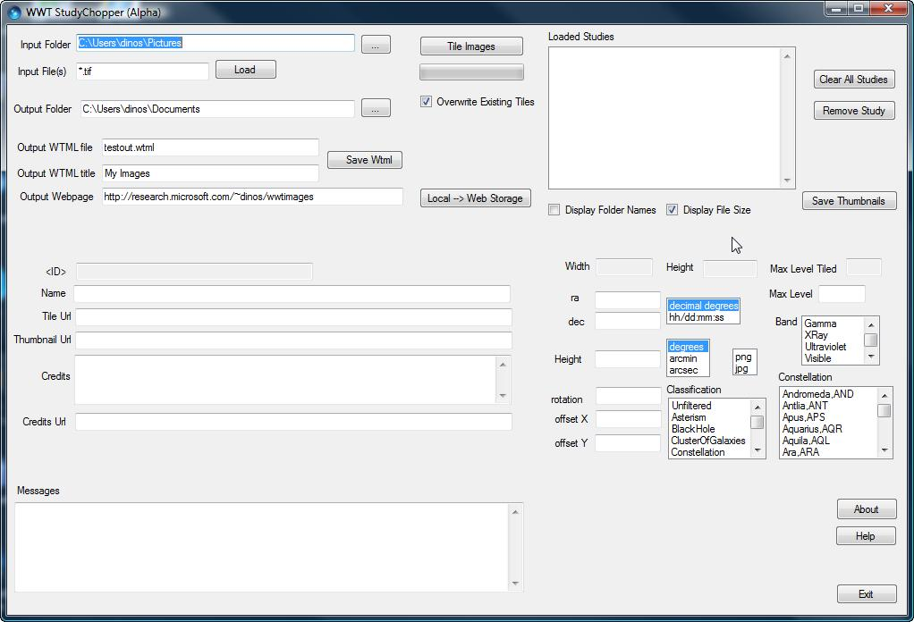
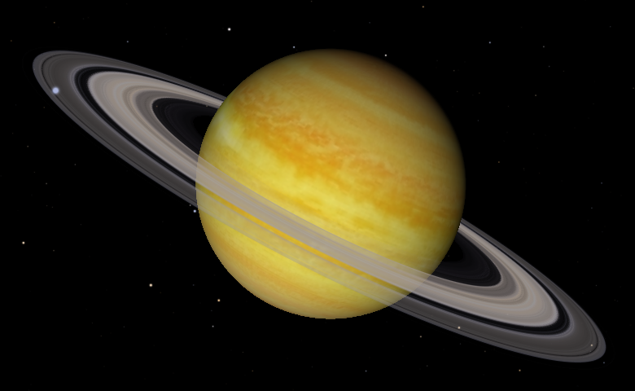
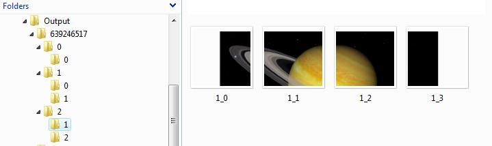
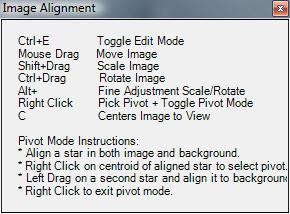

+++
title = "Study Chopper Tool"
weight = 100
+++

WWT Study Chopper takes as input a study image, and generates the tiled
multi-resolution image pyramid, in the correct folder structure and with the
correct names, that WorldWide Telescope can accept as foreground image data.
In addition to the image pyramid for each study, an appropriate thumbnail
image (96 pixels wide, by 45 in height) and two WTML files are also output.
One of these WTML files references the location of the thumbnail and pyramid
at a local address — useful for immediate testing purposes — and the second
references the intended public location when the work is ready for release.
The content of these WTML files can be used as standalone files, or can be cut
and pasted into a larger document such as a community payload file, or perhaps
a collection of similar studies.

The tile pyramid structure, and WTML files, are explained in detail in the
[WorldWide Telescope Data Files Reference](WorldWideTelescopeDataFilesReference.html)
document.


# The Study Chopper Dialog

The StudyChopper tool is very useful for data preparation, but its user
interface is somewhat functional and navigating it is not intuitive. For the
most part using the tool is simply a case of entering information in the
correct order, which is described in the following steps. Running the tool
will reveal the single dialog:




# Creating Image Pyramids and Thumbnails

Before using the tool, place all the images for the study in a single folder.
Preferred image formats are the lossless and transparency supporting formats
such as `.tiff` and `.png`, rather than `.jpg`. Then go through the following
steps:

1. Enter the folder name in the **Input Folder** text box.
2. Enter the name of a particular file, or file type using wildcard characters
   as required, in the **Input File(s)** box.
3. Select the **Load** button. This will populate the **Loaded Studies** list
   box with the image filenames. The tool will automatically remove images
   from the **Loaded Studies** list that cannot be loaded. The tool also
   cannot load very large images. In the latter case consider dividing the
   study into several smaller studies.
4. If necessary, use the **Clear All Entries** and **Remove Entry** buttons,
   and **Display Folder Names** and **Display File Size** checkboxes, to edit
   the list of images.
5. Enter the desired folder for the output to be written to, in the **Output
   Folder** text box.
6. The **Max Level** entry is calculated by the tool from the size of the
   source image. There is no reason to increase it, but it could be decreased
   for a large image during testing, but for the most part need not be
   changed.
7. Click the **Tile Images** button. This starts tiling as a _background_
   process. A progress bar will display underneath the **Tile Images** button.
   This process will also create the thumbnail images. If only thumbnail
   images are required, then click the **Save Thumbnail** button instead.
   Also, set the **Overwrite Existing Tiles** checkbox appropriately.
8. When the tiling process has completed (a line will appear in the
   **Messages** text box to indicate this), and without closing the tool,
   check the contents of the output folder — it should contain a complete
   image pyramid. In the example below a 780×480 image of Saturn was tiled.
   Note that there are three tiling levels (0, 1 and 2), and note also that
   there are only two entries, and not the full complement of four, at level
   2. This is because the height of the image is such that the top row (0) and
   bottom row (3) would have entirely empty tiles.

The number 639246517 is the ID number generated by the tool, and is a unique
number used as the top level folder name. The **<ID>** text box of the tool is
read-only.




If the image pyramid has been created correctly, go on to the next step of
creating the WTML files. If not, go back to the data and make the necessary
adjustments.


# Creating Local and Final WTML Files

Creating WTML files for the newly tiled study will make testing it, and
including it in larger collections, straightforward. To create the two WTML
files, go through the following steps:

1. Click the name in the **Loaded Studies** list to select the required study.
   Note that a number of fields such as **Name**, **Tile Url**, and
   **Thumbnail Url** are automatically populated, and these can be edited now
   by clicking on the list boxes or changing the text, or can be edited later
   (outside of the tool) by hand if needed. For example, the **Name** field
   can take a semi-colon separated list of names. The first name will be used
   along with the thumbnail to identify the study, and if a name is not
   entered, then the filename will be used as the name. Note the image
   thumbnail will appear to the right of the **Loaded Studies** text box.
2. Optionally, enter appropriate text into the **Credits** text box, and enter
   a valid link into the **Credits Url** text box. The link is provided to
   help users locate more information on the study.
3. If known, enter an appropriate **RA** and **Dec** for the image. An
   approximation might work well enough as the image can be finely aligned and
   scaled within WorldWide Telescope (refer to the section
   [Image Alignment within WorldWide Telescope](#ImageAlignmentwithinWorldWideTelescope)).
   Similarly for the **Height** of the image the default approximation of 6
   arc minutes (or 0.1 degree) can work well enough until the image is finely
   scaled.
4. If known, enter the **Classification**, **Constellation** and **Band**.
   These are not critical for the image to appear in WorldWide Telescope.
5. Enter the name of the final WTML file in the **Output WTML file** text box.
6. Enter a title in the **Output WTML title** text box to be used as the
   highest level Folder Name entry in the WTML file.
7. If the final location for the study is known, enter it into the **Output
   Webpage** text box. The final "/" in the URL is optional.
8. Click the **Save Wtml** button. This will create both local and final WTML
   files. These will be placed in the output folder specified for the creation
   of the pyramid. For the example Saturn study, the local file would look
   similar to this:

```xml
<?xml version='1.0' encoding='UTF-8'?>
<Folder Group="Explorer" Searchable="True" Type="Sky"
        Name="Saturn Study">
  <Place Name="Saturn" DataSetType="Sky" RA="0" Dec="0"
         Constellation="AND" Classification="Unfiltered"
         Magnitude="0" ZoomLevel="1.2" Rotation="0"
         Angle="0" Opacity="100" AngularSize="0">
    <ForegroundImageSet>
      <ImageSet
          Name="Saturn"
          Url="C:\Users\.....\Pictures\Output\639246517\{1}\{3}\{3}_{2}.png"
          AltUrl=""
          DemUrl=""
          BaseTileLevel="0"
          TileLevels="2"
          BaseDegreesPerTile="0.213333333333333"
          FileType=".png"
          BottomsUp="False"
          Projection="Tan"
          QuadTreeMap=""
          CenterX="0" CenterY="0"
          OffsetX="0" OffsetY="0"
          Rotation="0"
          DataSetType="Sky"
          BandPass="Visible"
          Sparse="True"
          WidthFactor="2">
        <Credits />
        <CreditsUrl />
        <ThumbnailUrl>C:\Users\.......\Pictures\Output\639246517.jpg</ThumbnailUrl>
        <Description />
      </ImageSet>
    </ForegroundImageSet>
  </Place>
</Folder>
```

To test the output, click on the LOCAL version of the WTML file, or
alternatively load this file from within WorldWide Telescope. This will
display the study and the thumbnails in WorldWide Telescope. Check not only
the images, but also the metadata such as the Name, Credits, CreditsUrl, and
so on.


# Plate Files

If the **Make .plate File** checkbox is checked, then in addition to building
the tile pyramid, a single .plate file will be output to the specified
location. A plate file contains every tile of the pyramid, and a header
section encoding the format of the pyramid. The purpose of this single file is
that it is then much easier to transmit the pyramid to colleagues, copy to a
backup file, or send it for some other purpose.


# AVM Tags

If the input image has AVM-tags, then the appropriate fields will be filled
automatically with their values. For more details on AVM tags, refer to
[Virtual Astronomy.org](http://virtualastronomy.org). AVM tagging is a
standard proposed by members of the professional astronomy outreach/educators
community to tag astronomical photographs with useful metadata that contain
details of what the photograph contains, how it was taken, copyrights,
credits, and so on.

Images (currently, only TIFF images) can be tagged with AVM tags from FITS
files using Adobe Photoshop and FITS liberator, or by using the online tagging
tool available on the Virtual Astronomy site.


# Image Alignment within WorldWide Telescope

It is possible to adjust the position of an image within WorldWide Telescope.
 The image to be aligned should be referenced from a collection file. For ease
 of navigation collection files should be located in the **My Documents\WWT
 Collections** folder. Collections in this folder will appear under the **My
 Collections** folder when WorldWide Telescope is run. So in order to enable
 easy editing, move the WTML file containing the images you wish to align to
 the **My Documents\WWT Collections** folder.

Open up WorldWide Telescope, navigate to the correct collections file, open
it, and select the image to be aligned by clicking on the thumbnail. Click on
the image itself when it appears in the main view, then press Ctrl-E. This
brings up the **Image Alignment** dialog:



Use the controls in this dialog to finely align an image.

Note that there is currently no save or cancel options. If the data is in the
correct folder, noted above, then the changes will be saved off to the
**Place** entry in the WTML file.

**Pivot Mode** can be one of the easiest ways to align an image. Right-click
on a point on the image that is in the correct location (typically a star), a
white circle will appear to confirm this, then rotate, scale, and invert the
image simply by moving the mouse. Right-click again to de-select **Pivot
Mode**. Typically aim to align two significant stars that are as far apart as
possible on the image to get the best alignment between foreground and
background.


# Initializing Study Chopper

StudyChopper reads in default settings from the `configStudyChopper.txt` file
when the tool is first run. Edit this file appropriately to make use of the
tool efficient. This can either be done by hand, or by use of the **Save
Settings in config.txt** button. This configuration file should reside in the
same folder as the tool. The default contents of this file are shown in the
following table:

```
INDIR=C:\Users\Public\Pictures
INFILE=*.tif
OUTDIR=C:\Users\Public\Pictures\tiles
OUTWTMLFILE=egstudies.wtml
OUTWTMLTITLE=Example Studies
OUTWEBDIR=http://research.microsoft.com/wwtimages
STOREONWWTSERVERS=False
MAKEPLATE=False
OVERWRITEEXISTINGTILES=True
CREATEJPEG=False
DISPLAYFOLDERNAMES=False
DISPLAYFILESIZE=True
```

Note — security issues may prevent the button/edited file from working as
expected.


# Command Line Input to Study Chopper

The Study Chopper tool can be run from a Command Prompt window, taking a
single parameter — the name of an XML file, where the content of that file
determines the required input and output.

To run the tool from the Command Prompt window:

1. Navigate to the location of StudyChopper.exe. By default this is:
   ```
   C:\Program Files (x86)\Microsoft\WWT ADK May 2009\
   ```
2. Create an XML file to define the inputs and outputs. The contents of the
   XML file should be as follows:
   ```xml
   <?xml version="1.0" encoding="utf-8"?>
     <!-- ************************************************************ -->
     <!--        Settings for the command line input for               -->
     <!--                the Study Chopper tool                        -->
     <!-- ************************************************************ -->
   <SettingsFile Type="Chopper">
   
     <!-- ************************************************************ -->
     <!--                        Required                              -->
     <!-- ************************************************************ -->
   
     <InputFolder>C:\Users\....\Documents\OneImage</InputFolder>
     <InputFiles>*.jpg</InputFiles>
     <OutputFolder>C:\Users\....\Documents\Test web</OutputFolder>
   
     <!-- ************************************************************ -->
     <!--                        Optional                              -->
     <!-- ************************************************************ -->
     <OutputFile>Chopper test.wtml</OutputFile>
     <OutputTitle>Chopper title</OutputTitle>
     <OutputWebpage>Output web URL</OutputWebpage>
     <Overwrite>True</Overwrite>
     <MakePlate>False</MakePlate>
     <SaveAsJpeg>False</SaveAsJpeg>
   </SettingsFile>
   ```
4. In the Command Prompt window type:
   ```
   StudyChopper {PATH}\FileChopper.xml
   ```
   where `{PATH}` is the full path to the XML file.
5. If this method of running the tool is used, and there are no errors, the
   tool will be opened, run, then closed. If there are errors the tool will be
   left open, in order to help identify the issue.
