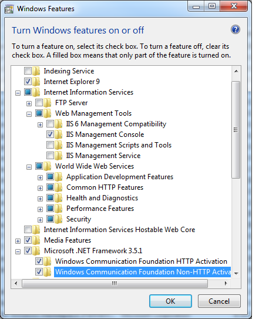
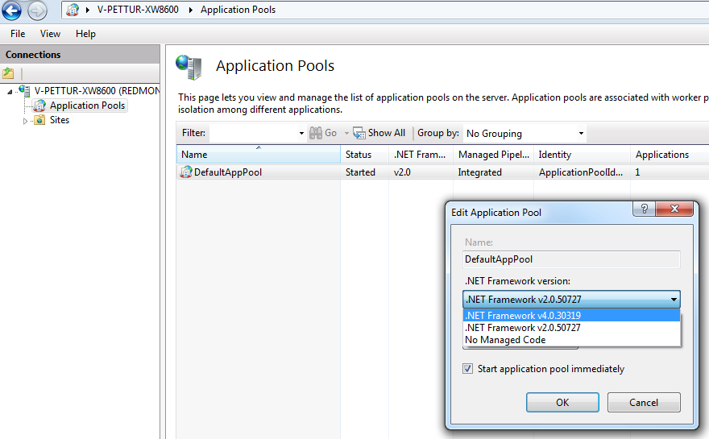

+++
title = "Samples"
weight = 400
+++

There are several sample applications provided with the SDK that demonstrate
how to use the APIs. Each of these samples deals with a different type of
dataset and produces a single collection that can be viewed in Worldwide
Telescope.

1. [BlueMarbleApp](#running-the-bluemarbleappexe-sample-with-a-single-image):
   This sample demonstrates how a single image in Equirectangular projection
   or
   [set of images in Equirectangular projection](#running-the-bluemarbleappexe-sample-with-multiple-images)
   can be transformed to Toast or Mercator projection image pyramids that can
   be visualized in WorldWide Telescope.
2. [SpecificRegionDataSet](#running-the-specificregiondatasetexe-sample): This
   sample demonstrates how an Equirectangular dataset in XYZ format, for a
   specific region of the world can be transformed to Toast or Mercator
   projection image pyramids that can be visualized in WorldWide Telescope.
   This sample also supports the Digital Elevation Model (DEM). A digital
   elevation model is a digital representation of ground surface topography or
   terrain. DEMs are used often in geographic information systems and are the
   most common basis for digitally-produced relief maps. This sample needs the
   [Sharing Service](#to-setup-the-sharing-service) application to be set up.
   The data needs to be comma separated containing longitude, latitude and
   depth values.
3. [WorldDataSet](#running-the-worlddatasetexe-sample): This sample
   demonstrates how a data set in XYZ format, for the entire world can be
   transformed to Toast or Mercator projection image pyramids that can be
   visualized in WorldWide Telescope. The data needs to be comma separated
   containing longitude, latitude and depth values.
4. [Sharing Service](#to-setup-the-sharing-service): This sample demonstrates
   how a web application can be set up to serve both images and DEM tiles to
   WWT, and Community data. It provides a means for users to share their
   collections with others, by accessing pyramids via URL rather than a local
   folder path. A Bing Maps integration sample source code in the Sharing
   Service folder explains how to have the tile pyramid created by this SDK
   displayed in Bing Maps (this works for Mercator projection only).

This document provides instructions on how to run these samples to generate
the image tile pyramid along with the WTML collection file that can be
visualized in WWT.


# Prerequisites

To run the samples ensure your system meets the hardware requirements and the
necessary software is installed, described in the
[Getting Started](https://www.gitbook.com/book/worldwidetelescope/worldwide-telescope-user-manual)
section.

## To Install IIS 7.5 on Windows 7

You can perform this procedure using the user interface (UI) or a script.

### Using the UI

1. Click `Start` and then click `Control Panel`.
2. In Control Panel, click `Programs` and then click `Turn Windows features on
    or off.`
3. In the Windows Features dialog box, click `Internet Information Services`
   and then click `OK`.

### Installing IIS on Windows Server 2008 and R2

[https://technet.microsoft.com/en-us/library/cc771209.aspx](https://technet.microsoft.com/en-us/library/cc771209.aspx)

When you install IIS, it is preconfigured to serve as a default Web site;
however, you may want to change some of the settings. To change the basic
settings for the Web site and to emulate the steps that are required to set up
Apache for the first time by using the configuration file:

1. Log on to the Web server computer as an administrator.
2. Click `Start`, point to `Settings`, and then click `Control Panel`.
3. Double-click `Administrative Tools`, and then double-click `Internet
   Services Manager`.
4. Right-click the Web site that you want to configure in the left pane, and
   then click `Properties`.
5. Click the `Web site` tab.
6. Type a description for the Web site in the `Description` box.
7. Type the Internet Protocol (IP) address to use for the Web site or leave
   the `All (Unassigned)` default setting.
8. Modify the Transmission Control Protocol (TCP) port as appropriate.
9. Click the `Home Directory` tab.
10. To use a folder on the local computer, click `A directory on this
    computer`, and then click `Browse` to locate the folder that you want to
    use.
11. To use a folder that has been shared from another computer on the network,
    click `A share located on another computer,` and then either type the
    network path or click `Browse` to select the shared folder.
12. Click `Read` to grant read access to the folder (required).
13. Click `OK` to accept the Web site properties.
14. Set .Net 4.0 as the default application pool. To do this type `inetmgr` in
    the start menu, access the Application Pools, and change the .NET
    Framework version to v4.0 (unless of course it is already set correctly).





## To Setup the Sharing Service

1. Open the command prompt using the "Run as Administrator" mode.
2. Make the `$(SDKInstallDir)\Sharing Service` folder the current directory
   (run `cd $(SDKInstallDir)\Sharing Service` from the command prompt).
3. Run `DeploySharingService.bat.`
4. Ensure all the pre-requisites have been installed or configured.
5. Enter `y` when prompted.
6. Upon successful installation, visit
   [http://localhost/SharingService/TileServiceSample.aspx](http://localhost/SharingService/TileServiceSample.aspx)
   to view the Tile Service Sample, and
   [http://localhost/SharingService/CommunityServiceSample.aspx](http://localhost/SharingService/CommunityServiceSample.aspx)
   to view the Community Service Sample.

The Tile Service will serve up image and DEM tiles created using the Tile
Pyramid SDK. By selecting one of the thumbnail images a tile pyramid can be
viewed in Worldwide Telescope.

The Community Service displays a range of sign up files to different
communities in the form of thumbnails and descriptions. If a thumbnail is
selected the community will be joined and the payload file sent to the user.
The account under which the Application Pool is running should have write
permissions to the Community Directory to support the caching of payload Xml.
The Community Service treats the following folder names as reserved: All
Tours, Latest, Plates, DemPlates and Pyramid.

For more information on Community files, refer to the
[WorldWide Telescope Data Files Reference.](https://www.gitbook.com/book/worldwidetelescope/worldwide-telescope-data-files-reference)

## Including DEM data

When using these samples with the sample data specified, or with any other
sample data, if DEM (digital elevation model) data is not available then it
can be obtained from Virtual Earth provided that the tiles created are in the
same Mercator projection as Virtual Earth.

To do this edit the following entries into the WTML file to get DEM for the
images:

```
ElevationModel="True"
DemUrl="http://ecn.t{S}.tiles.virtualearth.net/tiles/d{Q}.elv?g=1&amp;n=z"
```

# Running the Samples

## Running the BlueMarbleApp.exe sample with a single image

1. Download a single input Equirectangular image from
   [http://eoimages.gsfc.nasa.gov/ve//7100/world.topo.bathy.200401.3x5400x2700.jpg](http://eoimages.gsfc.nasa.gov/ve//7100/world.topo.bathy.200401.3x5400x2700.jpg)
   and save it to a folder. For example, save it to
   `C:\SDKInputData\world.topo.bathy.200401.3x5400x2700.jpg`.
2. Open the command prompt and navigate to the `(SDKInstallDir)\Tile Pyramid
   SDK\Samples` folder.
3. Execute the command below:

```
BlueMarbleApp.exe
  /Input=C:\SDKInputData\world.topo.bathy.200401.3x5400x2700.jpg
  /Projection=Toast
  /InputBoundary=<Top Left Latitude, Top Left Longitude, Bottom Right Latitude, Bottom Right Longitude>
```

With the following settings:

- `Input` — the path to an Equirectangular image in PNG or JPEG format. You
  can find a collection of Equirectangular images at:
  [http://visibleearth.nasa.gov/](http://visibleearth.nasa.gov/)
- `Projection` — Projection can be either Toast or Mercator. For more
  information please refer to:
  [WWT Projection Reference](https://www.gitbook.com/book/worldwidetelescope/worldwide-telescope-projection-reference)
- `InputBoundary` — An optional parameter, defining the input boundary in
  decimal degrees.
- `OutputDir` — Optional parameter, specifying the folder for output image
  pyramids and newly created wtml files. If no input is supplied, image tiles
  are stored in the `%ProgramData%\Microsoft Research\WWT SDK\Output` folder.

## Running the BlueMarbleApp.exe sample with multiple images

1. Download the Multipart Equirectangular images (A1, A1, A2, B1, B2, C1, C2,
   D1 and D2) from:
   [http://visibleearth.nasa.gov/view-detail.php?id=7100](http://visibleearth.nasa.gov/view-detail.php?id=7100)
   and save it to a folder. (note: these images are huge and would require a
   lot of processing power to run them. If you do not have a high end server
   machine at your disposal, try splitting the image downloaded in the
   previous step into to smaller parts and run this sample using them). Save
   it to `C:\SDKInputData\`.
2. Now build an XML file providing the location of each part and their
   corresponding bounding co-ordinates (see
   [sample here](#sample-xml-file-for-the-multi-part-equirectangular-image)).
   Call the sample XML file `MultiPart.xml`.
3. Open the command prompt and navigate to the
   `$(SDKInstallDir)\Tile Pyramid SDK\Samples`
   folder, and execute the following command:

```
BlueMarbleApp.exe
  /Input=C:\SDKInputData\MultiPart.xml
  /Projection=Mercator
  /InputBoundary=<Top Left Latitude, Top Left Longitude, Bottom Right Latitude, Bottom Right Longitude>
```

Where:

- `Input` — Points to the XML file that contains the image locations and their
  bounding coordinates.
- `Projection` — Projection can be either Toast or Mercator. For more
  information please refer to:
  [WorldWide Telescope Projection Reference](https://www.gitbook.com/book/worldwidetelescope/worldwide-telescope-projection-reference)
- `InputBoundary` — Optional parameter, defining the input boundary in decimal
  degrees.
- `OutputDir` — Optional parameter, specifying the folder for output image
  pyramids and newly created wtml files. If no input is supplied, image tiles
  are stored in the `%ProgramData%\Microsoft Research\WWT SDK\Output` folder.

## Running the SpecificRegionDataSet.exe sample

1. Download the Alaska Glacier bay data set from:
   [http://geopubs.wr.usgs.gov/open-file/of02-391/data/bathy.zip](http://geopubs.wr.usgs.gov/open-file/of02-391/data/bathy.zip)
   (442MB), unzip it and save it to a folder. Save it to `C:\SDKInputData\`.
2. Now navigate to the `$(SDKInstallDir)\Tile Pyramid SDK\Samples` folder and
   execute the following command:

```
SpecificRegionDataSet.exe
  /Input=C:\SDKInputData\glaciermulti.xyz
  /Projection=Toast
```

Where:

- `Input` — One XYZ data file for a specific region of the world where X is
  longitude, Y is latitude and Z is the value. Data should be in a regular mesh.
- `Projection` — Projection can be either Toast or Mercator. For more
  information please refer to:
  [WorldWide Telescope Projection Reference](https://www.gitbook.com/book/worldwidetelescope/worldwide-telescope-projection-reference)
- `OutputDir` — Optional parameter, specifying the folder for output image
  pyramids and newly created wtml files. If no input is supplied, image tiles
  are stored in the `%ProgramData%\Microsoft Research\WWT SDK\Output` folder.

## Running the WorldDataSet.exe sample

1. Download the ETOP01 xyz data set from:
   [http://www.ngdc.noaa.gov/mgg/global/relief/ETOPO1/data/bedrock/grid-registered/xyz/ETOPO1-Bed-g-int.xyz.gz](http://www.ngdc.noaa.gov/mgg/global/relief/ETOPO1/data/bedrock/grid-registered/xyz/ETOPO1-Bed-g-int.xyz.gz)
   (1GB file)
2. Use a standard uncompressing utility to extract the XYZ file.
3. Save it to a local folder. Save it to `C:\SDKInputData\`.
4. Open the command prompt and navigate to the
   `(SDKInstallDir)\Tile Pyramid SDK\Samples`
   folder, and execute the following command:

```
WorldDataSet.exe
  /Input=C:\SDKInputData\ETOPO1-Bed-g.int.xyz
  /Projection=Toast
  /ColorMap=colormap.png
  /ColorMapOrientation=Vertical
```

Where:

- `Input` — One XYZ data file for entire world where X is longitude, Y is
  latitude and Z is the value.
- `Projection` — Projection can be either Toast or Mercator. For more
  information please refer to:
  [WorldWide Telescope Projection Reference](https://www.gitbook.com/book/worldwidetelescope/worldwide-telescope-projection-reference)
- `ColorMap` — Path of a color map file used. A color map is used to assign
  colors to various points based on their z value and the colors available in
  the color map (from top to bottom in the case of a vertically oriented color
  map). A sample file color map is included in the samples folder.
- `ColorMapOrientation` — Two values allowed horizontal or vertical. This
  indicates the orientation of the color map specified in the previous
  parameter.
- `OutputDir` — Optional parameter, specifying the folder for output image
  pyramids and newly created wtml files. If no input is supplied, image tiles
  are stored in the `%ProgramData%\Microsoft Research\WWT SDK\Output` folder.

### Sample XML File for the Multi-Part Equirectangular Image

```xml
<?xml version="1.0" encoding="utf-8" ?>

<Regions>
   <Row>
    <Region name="A1">
      <ImagePath>C:\SDKInputData\A1.jpg</ImagePath>
    </Region>
    <Region name="B1">
      <ImagePath>C:\SDKInputData\B1.jpg</ImagePath>
    </Region>
    <Region name="C1">
      <ImagePath>C:\SDKInputData\C1.jpg</ImagePath>
    <Region name="D1">
    </Region>
      <ImagePath>C:\SDKInputData\D1.jpg</ImagePath>
    </Region>
   </Row>
   <Row>
    <Region name="A2">
      <ImagePath>C:\SDKInputData\A2.jpg</ImagePath>
    </Region>
    <Region name="B2">
      <ImagePath>C:\SDKInputData\B2.jpg</ImagePath>
    </Region>
    <Region name="C2">
      <ImagePath>C:\SDKInputData\C2.jpg</ImagePath>
    </Region>
    <Region name="D2">
      <ImagePath>C:\SDKInputData\D2.jpg</ImagePath>
    </Region>
   </Row>
</Regions>
```
